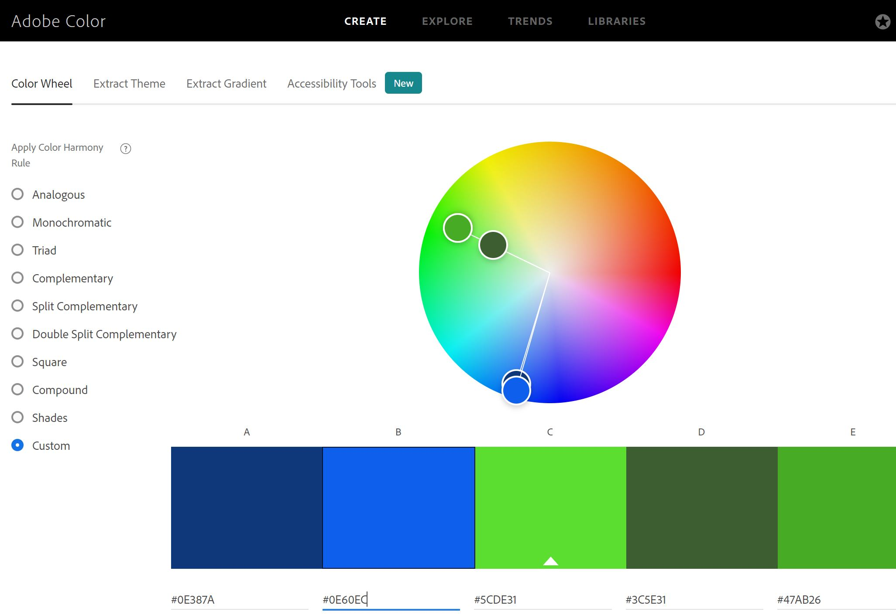
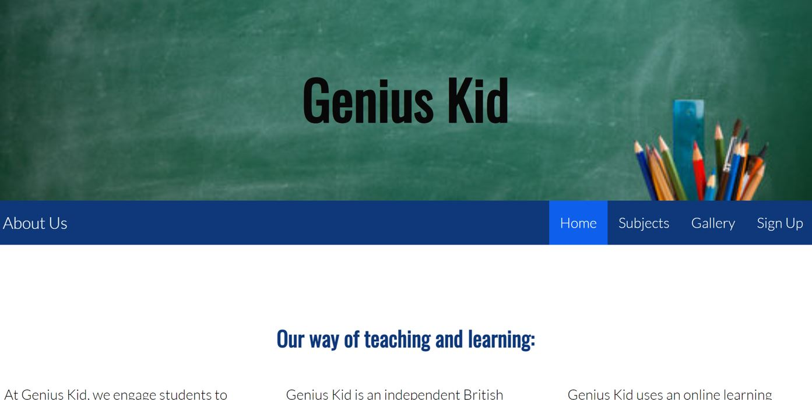
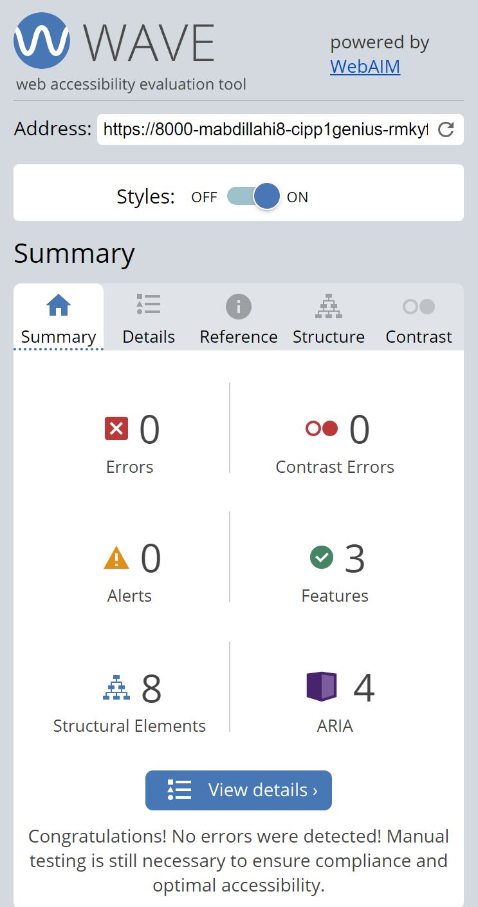

# Genius Kid
(Developer: Mohamed Abdillahi)

[Live webpage](https://mabdillahi88.github.io/CI_PP1_GENIUSKID/)

## Table of Content

1. [Project Goals](#project-goals)
    1. [User Goals](#user-goals)
    2. [Site Owner Goals](#site-owner-goals)
2. [User Experience](#user-experience)
    1. [Target Audience](#target-audience)
    2. [User Requrements and Expectations](#user-requrements-and-expectations)
    3. [User Stories](#user-stories)
3. [Design](#design)
    1. [Design Choices](#design-choices)
    2. [Colour](#colours)
    3. [Fonts](#fonts)
    4. [Structure](#structure)
    5. [Wireframes](#wireframes)
4. [Technologies Used](#technologies-used)
    1. [Languages](#languages)
    2. [Frameworks & Tools](#frameworks-&-tools)
5. [Features](#features)
6. [Testing](#validation)
    1. [HTML Validation](#HTML-validation)
    2. [CSS Validation](#CSS-validation)
    3. [Accessibility](#accessibility)
    4. [Performance](#performance)
    5. [Device testing](#performing-tests-on-various-devices)
    6. [Browser compatibility](#browser-compatability)
    7. [Testing user stories](#testing-user-stories)
8. [Bugs](#Bugs)
9. [Deployment](#deployment)
10. [Credits](#credits)
11. [Acknowledgements](#acknowledgements)

## Project Goals

### User Goals
- Finding a website that offers a good learning atmosphere with expert teachers
- See a full lists subject and necessary entry requirements
- Find information about the teaching and learning methods
- Find the location of the offices

### Site Owner Goals

 - Increase in the number of students
 -  increase revenue
 - increase the number of subjects on available
 - become a centre of excellence for teaching and learning

 ## User Experience

 ### Target Audience
- People looking for a online school that offers excellent teaching and learning environment
-  People looking for a online school that offers subject matter experts to generate good grades
-  People looking for a online school that offers STEM rich subjects
-  People looking for a online school that offers teaching and learning experience to range of age groups

### User Requrements and Expectations

- easy to use navigation system
- access to revelant entry requirements for each subject
- all links are working correctly
- responsive website that work on all commonly used devices
- asy sign up and contact details page

### User Stories

#### First-time User 

1. As a first-time user, I want to know where the online school main offices are located
2. As a first-time user, I want to more about the subjects available
3. As a first-time user, I want to get an aesthetics feel of the online school
4. As a first-time user, I want to know more about the teaching method of the online school

#### Returning User

5. As a returning user, I want to know the entry requirements
6. As a returning user, I want to find a phone number and email address to call for more information
7. As a returning user, I want to see the subjects on available 
8. As a returning user, I want to leave comment, suggestion, or message to the online school
9. As a returning user, I want to find the online school on social media
10. As a returning user, I want to get directions to the online school main offices

#### Site Owner 

13. As the site owner, I want users to know more about our teaching and learning method.
14. As the site owner, I want to give users an aesthetics feel of the online school 
15. As the site owner, I want the users to be able to contact us

## Design

### Design Choices
The webpage was designed to give parents an aesthetics feel of the online school. Parents would then be re-assured with our clear explanation of our methodology and stem-rich selection of subjects. 

### Colour
For the colour theme, bright and dark blue tones are used. When learning tough material, blue is a colour that stands for productivity. The ability of the colour blue to provide a secure, inviting learning atmosphere where students may grasp difficult and interesting material is well acknowledged.
 

### Fonts
Lato has several various styles and is quite legible, making it a suitable typeface for websites. Both fonts are considered dyslexia friendly.
 

Oswald is a sans serif font that pairs well with almost any other serif or sans serif typeface. It is that alluring and accommodating. It always adds contrast to a typographic combination because to its minor elongation. 

### Structure

The webpages have a familiar, identifiable, user-friendly, and simple to understand structure. When a visitor first visits a website, they are greeted by a recognizable navigation bar with the page's primary header located in the centre of each page.

There are five distinct pages on the website:

- A topic page that highlights in detail all the needs and expectations of each subject 
- An image gallery that highlights the aesthetics feel of the online school
- A homepage that breaks down our technique for online teaching into three sections.
- A registration page with a map of the area and contact information

### Wireframes

## Technologies Used

### Languages
- HTML
- CSS

### Frameworks & Tools

- Git
- GitHub
- Gitpod
- Balsamiq
- Google Fonts
- Adobe Color
- Font Awsome
- Favicon.io

## Features
The page consists of four pages 

### Navigation Bar

- Appeared on each of the four pages
- The navbar has links to the homepage, subject page, gallery page and sign-up page and is entirely responsive
- On smaller devices, it transforms into a toggler (hamburger menu icon)
- Users may navigate it easily, and the link to the page they are now on is highlighted

### Footer
- Appeared on each of the four pages
- Consists of three social media links
- User stories covered: 3, 9, 14

### Home
- Gives a description of the method used for teaching and learning and its facilities with a image of the students using the libary at the main offices to revisiong and learning together.

- User stories covered: 3, 14

## Validation

## Validation

### HTML Validation
The website's HTML was examined using the W3C Markup Validation Service. No problems or visible warnings are present on any of the pages.

